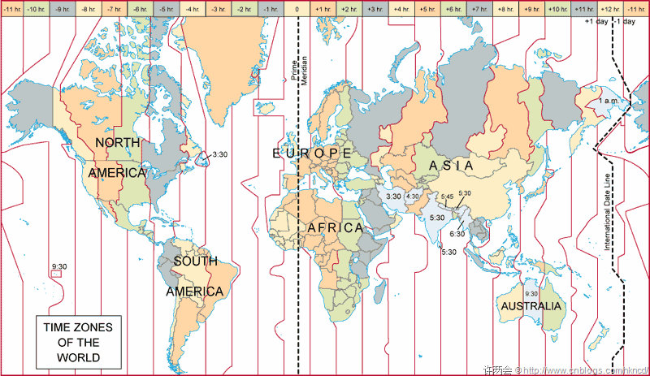
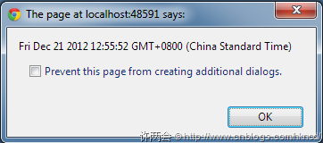

--- 
title: '[博客园旧文] 随心所欲的DateTime续' 
date: '2012-12-21'
--- 

[上篇提到DateTime的显示格式](http://www.cnblogs.com/hkncd/archive/2012/12/06/2805165.html)，忽略了一个重要元素--时区。多时区用户的项目的时间显示问题常常被人诟病，一旦时间跟金钱挂钩，出了问题就不是客服投诉骂两句那么简单了。那么究竟怎样才能构建一个满足多时区用户的项目呢？这要先从时区说起。

### 时区知多少



如图，全球被划分为24个时区，0时区为基准，每个时区相隔1小时，往东则加时间，往西则减时间，这种记时方式成为UTC（协调世界时）。比如北京在东边第八个时区，简称东八区，而东八区可简写为“UTC +8”。

在人类科技尚不发达的早期，人们用天文学知识计算时区时间，称为GMT（格林威治时间）。这种方式略有误差，但日常生活并不影响，后来随着科技的进步渐渐被UTC取代，但依然有人习惯性称GMT时间，因此，对我们来说，UTC和GMT意思等同。

在.Net中，用DateTime的UtcNow属性可快速获取0时区的时间，以我们所处的“UTC +8”为例，两者相差8小时：

```
Console.WriteLine(DateTime.Now);  // 2012/12/21 11:50:37
Console.WriteLine(DateTime.UtcNow); // 2012/12/21 3:50:37
```


### 可定义时区的时间类-- DateTimeOffSet

DateTime类没有时区信息，默认当前机器的时区。如果想指定时区，可使用DateTimeOffset类，时差用TimeSpan表示。比如，以下代码分别获取当前“UTC +2”和“UTC -5”的时间：

```
DateTimeOffset dt = new DateTimeOffset(DateTimeOffset.UtcNow.DateTime, TimeSpan.FromMinutes(120));
DateTimeOffset dt2 = new DateTimeOffset(DateTimeOffset.UtcNow.DateTime, TimeSpan.FromMinutes(-300));
```

为了方便，我用小时计算时差，但更准确的的单位应该用分钟。因为时区虽按小时划分，但有些城市地区所在的时区并不是整数，比如印度的新德里在**东5.5区**，加拿大的纽芬兰在**西3.5区**，还有一个逆天的尼泊尔在**东5.45区**，因此把时差换算为分钟更为准确。

>注：本来第一个参数使用DateTime.UtcNow，结果会抛出异常。因为第一个参数必须是时区为0的 DataTime ，而通过DateTime类属性获取的时间会默认当前机器的时区，因此，改成 DateTimeOffset.UtcNow.DateTime 就没有问题。

DateTime虽然默认了时区值，但无法获取，如要访问，需使用DateTimeOffset类的Offset属性，代码如下：

``` 
DateTimeOffset dt = new DateTimeOffset(DateTimeOffset.UtcNow.DateTime, TimeSpan.FromMinutes(120));
Console.WriteLine(dt.Offset); // 02:00:00
```

### 获取用户的时区信息

上面所述都是获取服务器时区的相关信息，那么，如何获取访问我们网站的用户的时区信息呢？很可惜，浏览器发送请求的时候并不带自身的时区，不过幸运的是，javascript提供了用户的时区信息。代码如下，运行结果如图。

```
var date = new Date();
alert(date);
```



如果你想获取用户在哪个时区，只能从字符串中拆分，不过javascript提供了函数可以直接获取时差，单位为分钟。

```
var offset = date.getTimezoneOffset(); //-480
```


### 如何应对多时区的用户

一个多时区的项目，如果在设计初考虑到时区，应将时间存为DateTime.UtcNow，这样结合时差可得任意时区时间。如果一个项目已存成了DateTime.Now，结果半路杀出多时区问题，除了骂娘以外，只能将时间切换为0时区，再根据时差计算。通常获取用户时区的做法是--javascript获取时差存入表单，并提交到服务器。

可是，并不是每次页面访问都有提交表单操作，如访问首页。如此一来必须要面对两个选择：

1. 将时间获取到页面上，通过javascript根据时差换算。
2. 将用户时差保存在数据库。

第一种麻烦且难以维护，容易造成重复代码；第二种一旦碰到用户时差改变，数据就没了意义。最重要一点是数据真实性，因为javascript获取的时间取自当前电脑，即该时间可随意更改。且要命的是，我们通过时区获取时差，时差得到时间，这个过程本身是不准确的，因为有[夏令时](http://baike.baidu.com/view/100246.htm)的存在。

也就是说，如果时间显示无关轻重，可采用以上应对方法。一旦时间和利益挂钩，就会造成很大的问题。那么，究竟该如何应对多时区用户的问题呢？下篇解答，未完待续。 ^_^