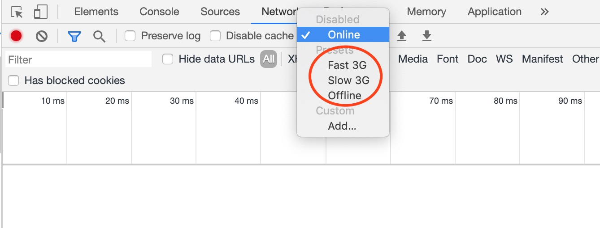

--- 
title: 'web端断点续传的思路和实现' 
date: '2020-06-11'
cover: './cover.jpeg'
--- 

<!-- ---
title: ''
--- -->

看过一道面试题要求实现断点续传，当时脑海大致想了一下实现思路，没完全想通，感觉涉及的知识点挺多，于是花了些时间用react和nodejs实现了一个简易版，并梳理了实现思路和用到的知识点。

简单汇总，用到的知识点如下：
1. 利用FileReader将上传文件切片
2. 用MD5算法获取文件唯一性标识
3. 用XHR显示上传进度
4. 比对文件大小，计算续传的开始节点
5. 自定制对文件的保存方法，确保异常终止时也能将未传完文件保存下来

[demo可以在此处下载](https://github.com/beforegolive/resumable-upload-demo)，另外，推荐使用chrome本身的网络限速来方便的测试断点续传功能。



### 前端部分
框架选择上用了React作前端呈现，利用axois做网络请求，用js-md5来获取文件唯一性标识。

#### 先说断点
断点的基础是将文件分段，在web端可用[FileReader](https://developer.mozilla.org/zh-CN/docs/Web/API/FileReader)类将文件以Buffer的形式读取，之后用原型链上的slice方法分段处理。

``` javascript
const reader = new FileReader()
reader.readAsArrayBuffer(uploadedFile)
```

此外，由于上传文件不通过html表单提交，在js端操作上传就需要使用FormData类来封装上传数据。

#### 再说续传
续传的前提是需要能识别出再次上传的文件是否与上一次相同，即必须先获取文件唯一性标识，其中MD5算法即可满足要求，因此我使用了第三方依赖js-md5。

另外，续传开始时需要知道从哪开始续，我在后端提供一个api接口，通过文件md5的值查询对应文件的大小，然后由前端再次上传前调用，并比较计算出续传的开始位置。

后端的具体实现会在下文提及。

#### 上传进度
刚开始的时候，我想简单的使用fetch来处理请求，但很快发现fetch本身的设计无法获取上传进度信息，底层实现上只能通过XHR拿到，因此引入了基于XHR的axois来处理上传。


### 后端部分
后端使用了koa加formidable组件来处理上传请求，尽管formidable稍显过时，网上更多人推荐multer，我对比了两者，最后决定选用formidable是因为它满足需求且文档详尽。

#### 自定义formidable中间件
为了能更灵活控制数据处理的部分，我参考了[koa-formidable](https://github.com/rkusa/koa-formidable/blob/master/index.js)写法，实现了一个自定义koa中间件。

``` javascript
const koaMiddleware = opt => {
	const tempFileDir = `./upload/tmp/`
	if (!fs.existsSync(tempFileDir, { recursive: true })) {
		fs.mkdirSync(tempFileDir)
	}

	return async function(ctx, next) {
		const form = formidable.IncomingForm()
		for (const key in opt) {
			form[key] = opt[key]
		}
		await new Promise((resolve, reject) => {
			form.parse(ctx.req, (err, fields, files) => {
				if (err) {
					reject(err)
				} else {
					ctx.request.body = fields
					ctx.request.files = files
					resolve()
				}
			})
		})

		await next()
	}
}

export default koaMiddleware
```

#### 接受分段数据
formidable本身提供了一系列事件来处理文件上传操作，比如fileBegin，file，data，aborted，end等等，但这些事件还无法完全满足保存分段数据的一些特殊场景，比如网络中断或异常的情况下，需要将未上传完的文件保存下来，这可能是断点续传功能在实际应用场景的价值所在，应对这种场景则需使用更细化的接收事件onPart。

在自定义onPart事件中，保存文件的核心方法使用了nodejs中的createWriteStream，使用flags:'a'来保证没有文件时创建文件，有了文件时则往文件中添加内容。

另外，在aborted调用end方法，确保网络异常的情况下，已上传的文件内容能被安全保存下来。

``` javascript
form.onPart = part => {
	const tempFilePath = `${tempFileDir}${part.filename}`
	const writer = fs.createWriteStream(tempFilePath, { flags: 'a' })
	form.on('aborted', e => {
	  writer.end()
	})

	form.on('end', () => {
	  writer.end()
	})

	part.on('data', buffer => {
	  writer.write(buffer)
	})
}
```


#### 查询当前文件大小
上面前端部分提到过，续传前需要知道从哪里开始续传，具体做法就是用已上传的文件大小和整个文件大小做个除法来得知续传的开始点。nodejs中[fs.statSync](https://nodejs.org/dist/latest-v12.x/docs/api/fs.html#fs_fs_stat_path_options_callback)方法可以获取当前文件状态，通过size属性拿到当前文件的大小。

然后将这些通过API开放给前端，使其能在续传前获取相关信息。
``` javascript
router.get('/get-tmp-file-size', async ctx => {
	const { name } = ctx.query
	const filePath = `./upload/tmp/${name}`
	try {
		const instance = fs.statSync(filePath)
		ctx.body = { size: instance.size }
	} catch (err) {
		ctx.body = { size: 0 }
	}
})
```

### 最后

总体而已，在我尝试编写demo的过程中，涉及的知识点渐渐超过了一开始的预期，每个点深挖下去都能牵扯出更多的内容，比如上传取消的功能，demo中我尝试用axois的CancelToken来实现，但使用后发现只能在文件上传前生效，一旦文件开始传输则无法取消，因此当前demo中的取消上传是通过最简单的刷新页面完成的。

从面试的角度来说，这无疑是一个很好的题目，但假如工作中未接触或留意过上传相关的功能，在时间有限的情况下，其难度也是显而易见，在此祝每个面试中碰到此题的朋友们能有好运气。


