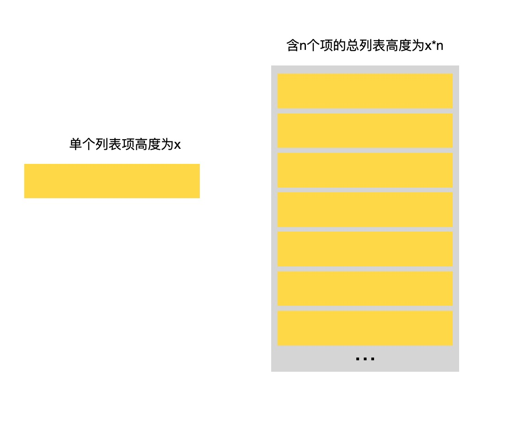
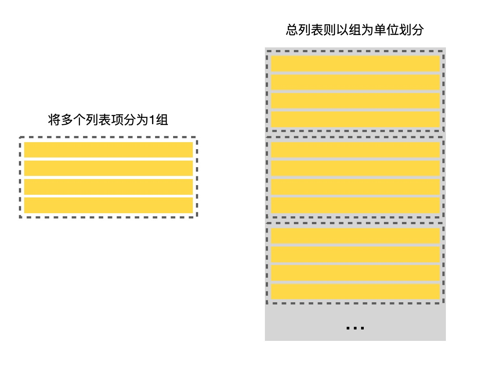
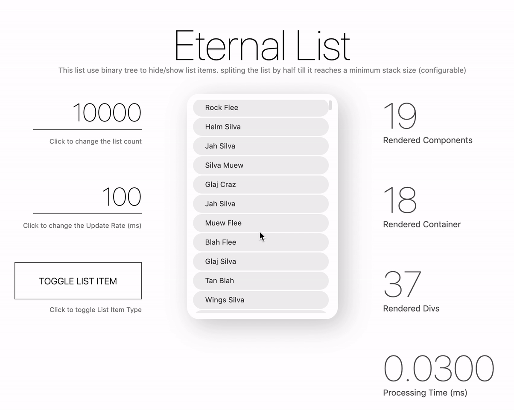

--- 
title: '如何顺滑的展示大数据列表' 
date: '2020-06-18'
cover: './cover.jpeg'
--- 

每每谈到前端性能优化，大数据列表的呈现总是一个老生常谈的话题。基于浏览器本身处理DOM的方式，一旦列表数据足够大时，总是不可避免的出现CUP和内存占用导致的卡顿问题，因此，针对大数据列表，只能使用特别的方式来呈现。

面对这个问题时，直觉反应就是切分：切成小块再呈现。比如，现在有10万条数据，仅仅拿出前1000条呈现出来，随着滚动条的滑动再逐步展示后面数据。然而，这种方式引起的列表高度变化会给用户带来非常糟糕的滑动体验，无论是补充数据还是把原列表换掉，使用起来跟标准滚动条差别非常大。因此，仅仅是切分还远远不够。

### 定高

为了防止列表高度变化带来的滚动体验问题，需要在大列表呈现时就先计算好高度。也就是说当要呈现10万条数据时，即使只先呈现前1000条，10W条数据的总高度要先被算好并设置在最外层的容器上。目的是当滑动时，呈现的数据变化，但容器总高度不变，这样体验起来才会和普通滚动条一致。


给10万条数据定高，就意味着你需要知道每一条数据呈现出来的高度是多少，在代码实现层面，可以拿出其中一条数据展示出来获取其高度。如此一来，不但总容器的高度能确定，每一条数据在纵坐标的起始位置也能定下，为后续的滑动展示提供基础。




### 分组

一旦高度定下，就可以根据滚动条的的位置展示或隐藏列表数据，但具体的代码实现却不得不考虑性能问题，因为需要遍历整个列表逐个判断，10W条数据遍历一次也是特别大的运算，更糟糕的是，滚动条滑动的事件触发是非常频繁的。

解决方案就是分组，即将100个或1000个划分为一组，以组为单位进行判断，同时，需要在定高时根据每一项高度计算出组的纵坐标起始位置。如此一来，遍历时以组为单位大大减少了计算量，10W条数据，1000个为1组，遍历起来也就只有100组而已。




分组后，滑动展示时便可以灵活制定展示规则，比如滚动条划过当前组高度一大半以后展示下一组等。


### 分组算法

因为看了国外一篇写大数据列表的文章有感，才写了此文。值得一提的是，那篇文章中的分组方式很特别，利用二叉树算法，一个简洁递归就把数据分好了。

```javascript
recursiveSplit =(data)=> {
    if(data.length / 2 > this.minimumStackSize) {
      let mid = Math.floor(data.length/2, 10);
      let node = { 
        parent: true,
        getParent: ()=> data,
        data: [this.recursiveSplit(data.slice(0, mid)), this.recursiveSplit(data.slice(mid, data.length+1))]
      }
      return node;
    }
    return {
      parent: false,
      data
    }
  }

```

作者最终Demo的效果如图，相关链接我已贴在文章底部。





### 结语

处理大数据列表的呈现，关键点有两个，一是定高，二是分组。定高保证了选择性呈现数据时滚动条的正常体验，分组则处理了频繁遍历带来的性能消耗。


##### 参考资料：

https://medium.com/better-programming/how-i-rendered-a-massive-list-in-react-without-memory-and-cpu-issues-7ac6fe6a697b

https://react-eternal-list.rinas.in/

https://github.com/rinasm/react-eternal-list#readme


