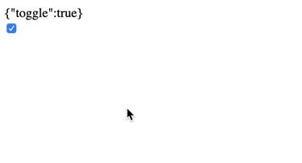

--- 
title: '如何编写hooks风格的redux组件' 
date: '2020-07-01'
cover: './cover.jpeg'
--- 

Hooks特性在React的16.8版本被引入，在解决组件重用和生命周期逻辑破碎两大难题的同时，极大简化了组件写法，而且兼容旧写法，即便不想学也没关系，向开发者释放了极大的善意。

可是，组件写法的改变或多或少会让人有些顾虑，尤其是和第三方组件集成，开发社区中也出现了一些类似“Redux是否要被Hooks取代”的声音，就像之前的React Context特性出现的时候一样，大伙的第一反应总是先问Redux是不是要被取代了，即使两者之间并无太多冲突，不过这也侧面反映了Redux框架在社区中的受众之广。

实际上，React-Redux组件库作为粘合剂从7.1.0开始已支持Hooks特性，这让我们写redux组件的时候不再需要connect方法，我们通过一个例子来展示如何写Hooks风格的redux组件。下面代码展示了一个复选框，使用了常见的connect方法将组件和store连接起来。

``` javascript
import React, { Component } from "react";
import { connect } from "react-redux";
import { toggleSwitch } from "./UiReducer";

class Toggle extends Component {
  render() {
    const { ui, toggleSwitch } = this.props;
    return (
      <div>
        <div>{JSON.stringify(ui)}</div>
        <input
          type="checkbox"
          value={ui.toggle}
          onChange={toggleSwitch}
        />
      </div>
    );
  }
}

const mapStateToProps = ({ ui }) => ({
  ui
});

export default connect(
  mapStateToProps,
  { toggleSwitch }
)(Toggle);
```

最终效果如下：



那么，接下来我们尝试把这个组件重构成hooks风格的redux组件。

#### 第一步：重构成函数组件

用函数来代替class组件，并且我们将ui和toggleSwitch从组件属性中解构出来，这一步相对简单，代码也得到了极大的缩减。

``` javascript
import React from "react";
import { connect } from "react-redux";
import { toggleSwitch } from "./UiReducer";

const Toggle = ({ ui, toggleSwitch }) => (
  <div>
    <div>{JSON.stringify(ui)}</div>
    <input type="checkbox" value={ui.toggle} onChange={toggleSwitch} />
  </div>
);

const mapStateToProps = ({ ui }) => ({
  ui
});

export default connect(
  mapStateToProps,
  { toggleSwitch }
)(Toggle);
```

#### 第二步：使用useSelector
现在，我们不再使用connect方法，react-redux提供了useSeletor方法让我们可以直接从hook中读取store的值。

``` javascript
import { connect, useSelector } from "react-redux";
```

``` javascript
const Toggle = ({ toggleSwitch }) => {
  const ui = useSelector(state => state.ui);
  return (
    <div>
      <div>{JSON.stringify(ui)}</div>
      <input type="checkbox" value={ui.toggle} onChange={toggleSwitch} />
    </div>
  );
};
```


#### 第三步：使用useDispatch
像第二步一样，我们可以直接通过hook获取到dispatch方法，然后根据需要执行自定义的action。

``` javascript
import { useSelector, useDispatch } from "react-redux";

...

const dispatch = useDispatch();

```

#### 完成

最终，我们的代码会被重构成下面这样：
``` javascript
import React from "react";
import { useSelector, useDispatch } from "react-redux";
import { TOGGLE } from "./UiReducer";

const Toggle = () => {
  const ui = useSelector(state => state.ui);
  const dispatch = useDispatch();
  return (
    <div>
      <div>{JSON.stringify(ui)}</div>
      <input
        type="checkbox"
        value={ui.toggle}
        onChange={() => dispatch({ type: TOGGLE })}
      />
    </div>
  );
};

export default Toggle;
```
可以看到除了代码的简化外，相比较原connect写法，store中的值不再从组件的属性传入，假如你使用typescript或flow，也省却了属性中对类型的声明，更进一步简化了组件写法，从这个示例中能明显感受到Hooks带来的好处，也许，从现在开始就可以把connect方法扔掉了。


> #### 参考资料

> [Hooks-Intro](https://reactjs.org/docs/hooks-intro.html)

> [how to use redux with react hooks](https://medium.com/better-programming/how-to-use-redux-with-react-hooks-5422a7ceae6e)


