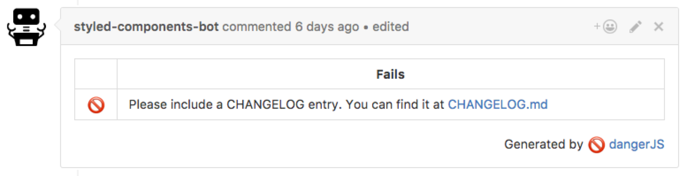
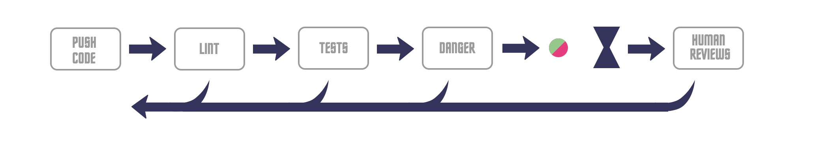
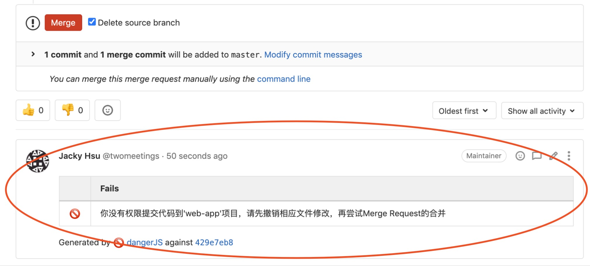
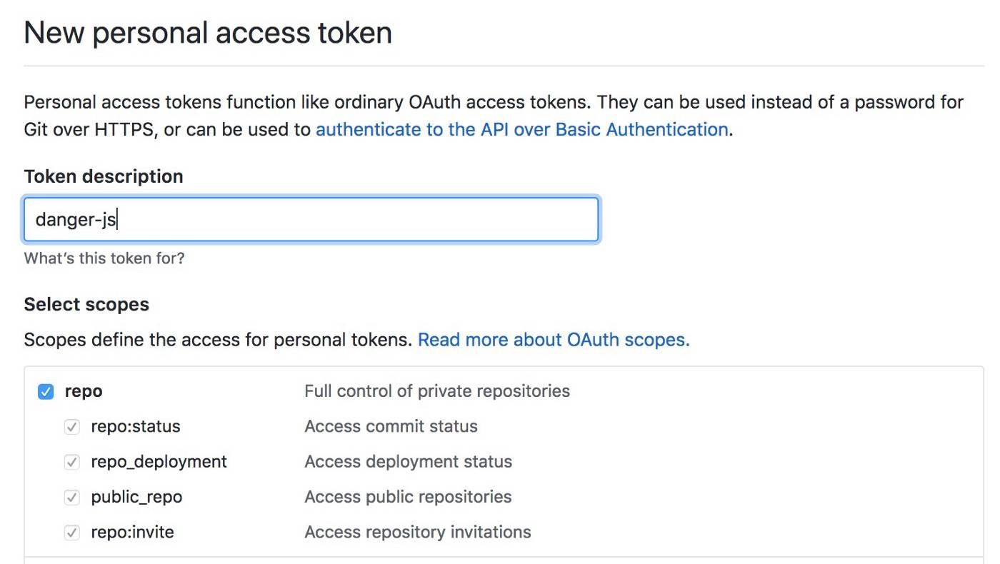
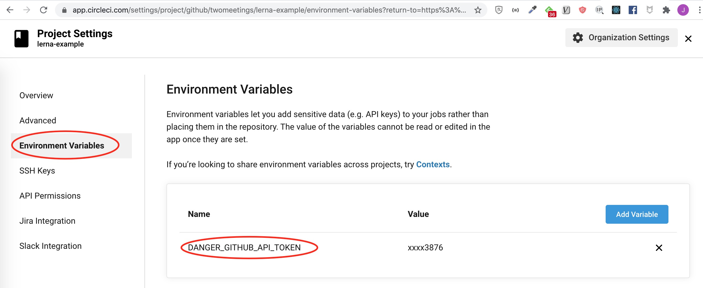
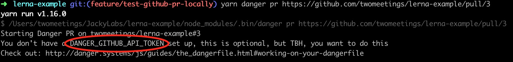
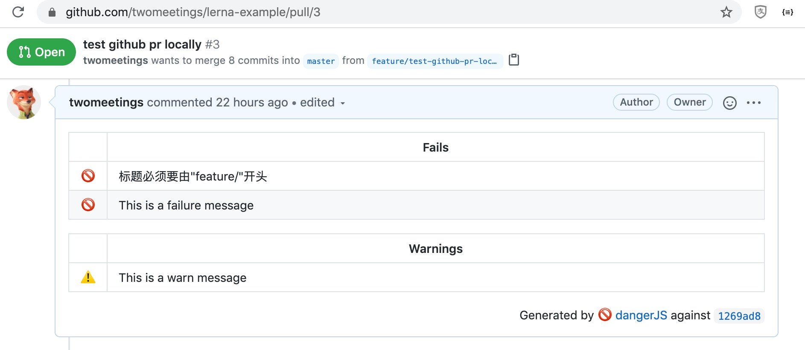
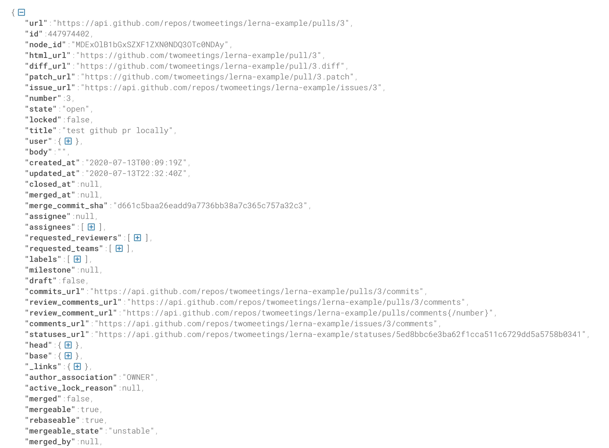

--- 
title: '试了就戒不掉的CI工具-dangerjs' 
date: '2020-07-14'
cover: './cover.jpeg'
--- 

在开源社区中，danger的使用尤其普遍，它可以拿来自动判断每个人提交的代码合并请求（github中叫Pull Request，下文简称PR，gitlab中叫Merge Request，下文简称MR）是否符合规范，自动化一些费时费力的人工检查，从而保证代码质量，是项目管理的利器。

比如开源项目[styled-componet](https://github.com/styled-components/styled-components)的这个自动回复机器人就是用danger实现的。



Danger最初是由ruby社区发展起来，之后增加了对js语言的支持，衍生出DangerJs。从它的标语中即可看出此工具存在的意义：**Stop saying "you forgot to …" in code review**，实际上，此工具可做的事情要远比标语中描述的多。

在整个代码合并流程中，danger的位置通常在测试和代码规范化检查的后一步，人工检查的前一步，相当于是足球中的清道夫的角色，



danger常见的使用场景是：通过自定制的脚本自动化处理一些费神的人工检查。我以前在项目中使用dangerjs在gitlab上实现过这样的检查：合并代码时有没有勾选“合并后删除远端分支”的复选框，有没有勾选“合并时压缩git节点”的复选框，有没有在合并标题中写上对应电子看板的任务卡ID等等，如果没有操作这些则禁止代码合并，及其方便的规范了整个团队的git开发流程。

在上篇[介绍lerna的文章](https://juejin.im/post/6847902224794943495)里，用dangerjs实现了子项目权限检查：判定当前提交人是否满足某个目录的提交权限，不满足则不允许代码合并，效果如下图所示。




### 安装Dangerjs
Dangerjs支持github和gitlab两大代码托管平台，也支持私有gitlab服务器，不过它对github的支持最好，简单几步在即可在一个github项目中加入danger检查。

在你的项目中，dangerjs用起来就像其他任何npm包一样，一行命令即可安装。（注意包名没有js后缀）

```javascript
yarn add -D danger
```

### 设置github的token
danger需要使用你的token授权来做相应操作，比如添加评论到对应的PR下方给出提示。你可以点击[此链接](https://github.com/settings/tokens/new)在github上生成对应token，token的名称可以随便起，权限要记得给足。



### 将token保存到环境变量中
需要把token的变量名命名为`DANGER_GITHUB_API_TOKEN`，并且保存在CI的配置里，比如我在github中使用了circleci作为持续集成的工具，token就需要保存到如下位置，见截图：



注意，如果是gitlab公网上的项目，那变量名就不一样了，需设置为`DANGER_GITLAB_API_TOKEN`, 如果是私有gitlab服务器，还需要添加另外一个变量`DANGER_GITLAB_HOST`将地址指向你自己的服务器，详情可参考[官网配置文档](https://danger.systems/js/usage/gitlab.html)。

### 创建dangerfile.js文件
项目根目录下创建dangerfile.js文件用于编写对应的脚本，比如下面几行代码就是最常用的写法。
```javascript
import { danger, fail, warn } from 'danger'

fail('This is a failure message') // 显示一条错误信息

warn('This is a warn message') // 显示一条警告信息

const { title } = danger.github.pr
if (!title.startsWith('feature/')) {
	fail('标题必须要由"feature/"开头')
}
```

### 本地测试danger脚本
在脚本正式推向CI环境前，可以本地测试一下脚本是否符合预期。首先要创建Pull Requst，然后获取此PR的地址，之后使用npm或者yarn执行命令：
```
yarn danger pr 创建的PR的地址
```

此时，你可能会碰到下面这样的提示，这是因为还没有在本地设置token变量。



本地直接执行一下命令来声明变量即可。
```
export DANGER_GITHUB_API_TOKEN=xxxxxx
```

设置token变量后重新执行`danger pr`的命令。访问对应的PR地址，如果看到下图这样的效果，说明你写的dangerjs脚本生效了。




最后，把`yarn danger ci`或者`npm danger ci`放在你的CI文件中的合适位置，这样danger就添加完成了。

另外，你可以申请一个github账号名为'xxxx-bot'，再贴一张机器人图片作为头像，并用此账号的token作为变量来自动回复，最终能让整个效果更显技术含量。 

### 能获取到的数据
除了标题之外，danger能获取当前PR中的各种信息字段，比如用户信息、修改的文件、代码审核人、代码合并的配置等等，从下面的截图里包含了一些常用字段。



除此之外，[dangerjs的官网](https://danger.systems/js/reference.html)也给出了详细的类型数据，你可以根据需要定制符合自己项目需求的检查脚本。

### 结语
danger可以在合并代码时提供自定义的合并规则，能规范整个项目的开发流程，把它整合到CI中能帮你自动化很多繁琐的人工检查，无论是开源项目还是日常开发项目，danger都是项目流程管理的利器，一旦试过你就再也戒不掉。


> **相关资料**

> [integrate-danger-js-in-5-minutes](https://medium.com/@ivan.ha/integrate-danger-js-in-5-minutes-55515bc5355d)

> [dangerjs官网](https://danger.systems/js/)

> [文章中的PR地址](https://github.com/beforegolive/lerna-example/pull/3)
